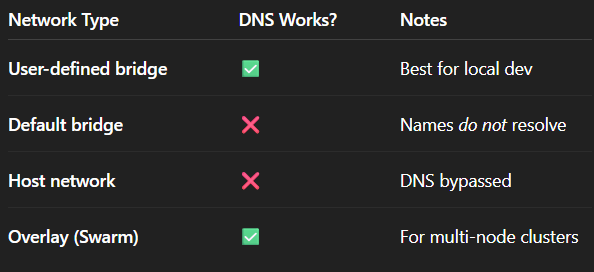

# NETWORKS

* bridge -> default
* user defined network
* host
* local

------------------------------

# DOCKER COMMANDS GYAAN

* docker network
* docker network ls
* docker network inspect bridge
* docker run -itd --rm --name=nginx_container nginx
* docker run -itd --rm --name=busybox_container busybox
* docker exec busybox_container ping 172.17.0.2 (docker exec busybox_container ping <nginx_container-IPADDRESS>)
* docker network create play-net
* docker run -itd --network=play-net --rm --name=alpine_container alpine
* docker network inspect play-net
* docker run -itd --network=play-net --rm --name=alpine_container_2 alpine
* docker exec alpine_container ping busybox_container (error -> ping b/w different network's containers)
* docker network connect play-net busybox_container
* docker exec alpine_container ping busybox_container
* docker network disconnect play-net busybox_container
* docker network inspect play-net
  
--------------------------
    
# THEORY

**Q-Why can BusyBox ping Nginx, but Nginx cannot ping BusyBox?**

Because nginx containers use an extremely minimal OS image, and PING (ICMP) is not included inside the nginx container.

👉 So the real answer:

It fails because the NGINX image does not ship with the ping binary.
BusyBox ships with ping, so ping works from BusyBox → Nginx but not the other way.

This is NOT a network issue.
This is a tools available inside the container issue.

🔧 If you want to add ping to Nginx (not recommended for prod):

Use this Dockerfile:
**FROM nginx:alpine**
**RUN apk update && apk add iputils**

Now:
**docker exec -it nginx_container ping busybox_container**
will work.

-----------------------

**Q-Why can we use container_name and container_ip both for communication between each other?**

Because Docker gives you two different networking layers:

1. DNS-based name resolution
2. Direct IP-based routing

Docker ALSO runs an internal DNS system

Inside every container's /etc/resolv.conf, you’ll see:
nameserver 127.0.0.11

This is Docker's internal DNS server.

Its job:

👉 Map container_name → container_ip
👉 Update automatically when containers restart
👉 Avoid hardcoding IPs in microservices

So Docker DNS resolves:

backend   → 172.18.0.2
frontend  → 172.18.0.3
redis     → 172.18.0.4

That's why you can do:
curl http://backend:8080
and Docker internally transforms it into the IP.

🎉 **Final Answer (Corporate-ready)**

Containers can communicate using BOTH:

* IP (because of Linux bridge routing)
* Name (because of Docker's internal DNS)

BUT you should ALWAYS use container names, because Docker DNS guarantees stability even if containers restart or scale.

----------------------------------

**DNS only works inside “user-defined” networks**

Important:

When you do:
**docker network create mynet**
Docker enables DNS.

When you DON’T create a network:

**docker run ...**    # default bridge

Container name resolution won’t work.

-------------------------------
**Docker DNS resolves only container names, not domains**

Inside a network, DNS resolves:

* container names → IP
* service names (in docker compose) → IP

Example (docker compose):

services:
    backend:
    frontend:

Inside frontend container:
curl http://backend:8080

Works because Compose uses Docker DNS.

--------------------------------

**Docker DNS works via embedded “dnsmasq-like” server**

Inside /etc/resolv.conf of any container, you’ll see:

**nameserver 127.0.0.11**

This is Docker’s internal DNS server.

That server:

* Maintains container → IP mapping
* Handles name lookups
* Refreshes entries dynamically
* Falls back to system DNS for normal domains
* It's extremely lightweight and fast.

---------------------

Docker DNS:

1. Creates automatic hostname resolution
2. Works only in user-defined networks
3. Maps container names → IPs
4. Updates dynamically on restart
5. Enables microservices to talk without hardcoding IPs
6. Uses 127.0.0.11 internally
7. Does NOT require any extra config

This is the backbone of container-to-container communication.

-----------------------

**Manage networks**

Commands:
  * connect     Connect a container to a network
  * create      Create a network
  * disconnect  Disconnect a container from a network
  * inspect     Display detailed information on one or more networks
  * ls          List networks
  * prune       Remove all unused networks
  * rm          Remove one or more networks

